<!-- Every panel is a self-contained animated SVG built by ./scripts.
     hero / projects: generated locally when the content changes.
     neofetch / contributions: regenerated daily by .github/workflows/refresh-profile.yml -->

 

<h3><code>Harnoor Singh Khalsa ~ $ ls ~/projects</code></h3>

<table>
<tr>
<td width="50%"></td>
<td width="50%"></td>
</tr>
<tr>
<td width="50%"></td>
<td width="50%"></td>
</tr>
</table>

<h3><code>harnoor@tiet ~ $ git log --since="1 year ago"</code></h3>

<h3><code>harnoor@tiet ~ $ cat contact.txt</code></h3>

<b>About me, in plain text</b>

 

Fourth-year Computer Engineering student at Thapar Institute of Engineering and Technology, focused on machine learning and applied AI. Most of my work sits at the intersection of structured ML pipelines (feature engineering, ensembling, calibration) and AI-assisted software engineering, where I treat large language models as build partners under a disciplined, spec-driven process rather than ad hoc prompting.

Currently building **[Realtime-Delivery-ETA](https://github.com/Harnoor001/Realtime-Delivery-ETA)** in public: a streaming ETA service for food and quick-commerce delivery.

Every panel above is a hand-rolled animated SVG generated by <a href="./scripts">./scripts</a>; the live ones refresh daily via GitHub Actions.

